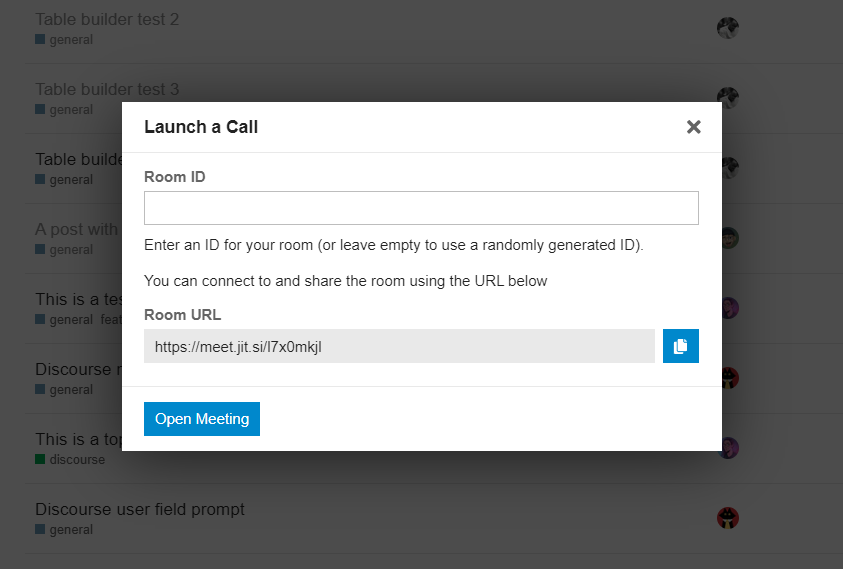

# 🎥 Discourse Video Theme

> Theme component for adding a "Create a meeting" button

## 🔗 Theme URL

You can use the following URL to install this theme:

```
https://github.com/jacobtread/discourse-meeting-theme
```

## ❓ What

This theme adds a new video icon to the the menu, this button can referrer to services like [Zui](https://zui.nz) to
make it easy to create and share meetings with others.


Clicking this menu button opens a dialog where you can create a meeting:


